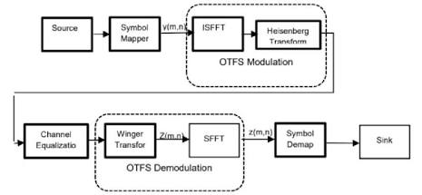
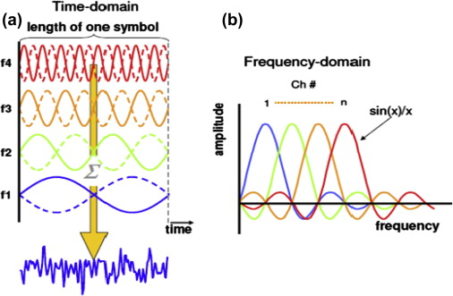

# 6G OTFS FPGA Baseband Design - Lab Notebook

**Intern:** Prasanth Hariharan  
**Timeline:** May 18, 2026 – July 13, 2026 (8 Weeks)

Welcome to my digital lab notebook for the FPGA-based evaluation of 6G waveforms.  
This repository tracks my daily progress, code models, and RTL architecture implementations.

---

## Project Timeline & Daily Logs

### 🔹 Week 0-1: Literature Review & Mathematical Modeling

*Focus: Mastering OTFS fundamentals and building the Python floating-point reference model.*

---

### **Day 1 (May 18): Foundations of 1D vs 2D Signals & understanding Matrix D**

#### **Objective:**

1. Revisit 1-D concepts of DFT and DTFT and how they translate to 2-D.
2. Understand the difference between DFT and OTFS.
3. Understand the Delay–Doppler information matrix ($D$).

##### 1. DFT (the frequency domain)

Let $\mathbf{x}[n]$ be a discrete-time signal:  
Then its DTFT $\mathbf{X}[e^{j\omega}]$ is given by

$$
\mathbf{X}(e^{j\omega}) = \sum_{n=-\infty}^{\infty} \mathbf{x}[n] e^{-j\omega n}
$$

##### 2. The Transition to the Discrete Fourier Transform (DFT)

Because digital hardware cannot compute or store an infinite, continuous frequency spectrum $X(e^{j\omega})$, the DFT samples the DTFT at $N$ evenly spaced discrete frequency bins ($\omega_k = \frac{2\pi k}{N}$).

For a finite-length vector $\mathbf{x}$ of length $M$, this operation simplifies into a clean matrix-vector multiplication:

$$
\mathbf{X} = \mathbf{W} \cdot \mathbf{x}
$$

Where $\mathbf{W}_M$ is an $M \times M$ square transformation matrix built using the standard symmetric twiddle factors:

$$
W_M = e^{-j\frac{2\pi}{M}}
$$

##### 3. Scaling 1-D DFT to 2-D DFT

When a signal varies across two separate dimensions simultaneously (like a 2D grid of pixels or spatial data), a standard 2-D DFT processes horizontal and vertical variations at the same time.

Mathematically, this is executed as a "matrix sandwich" by applying the 1-D DFT matrix twice. For an $M \times N$ matrix $\mathbf{D}$:

$$
\mathbf{X}_{2D} = \mathbf{W}_M \cdot \mathbf{D} \cdot \mathbf{W}_N
$$

- Multiplying by $\mathbf{W}_M$ from the **left** applies the 1-D transform down every individual **column**.
- Multiplying by $\mathbf{W}_N$ from the **right** applies the 1-D transform across every individual **row** (leveraging matrix symmetry where $\mathbf{W}^T = \mathbf{W}$).

##### 4. Understanding the Difference: Standard 2-D DFT vs. OTFS (ISFFT)

While a standard 2-D DFT runs a *forward* transform on both the rows and columns to map data completely from space to frequency, the OTFS transmitter relies on the **Inverse Symplectic Finite Fourier Transform (ISFFT)**.

The ISFFT converts your data from the Delay-Doppler domain into a Time-Frequency grid ($\mathbf{X}_{TF}$) using a hybrid matrix multiplication sandwich:

$$
\mathbf{X}_{TF} = \mathbf{W}_M \cdot \mathbf{D} \cdot \mathbf{W}_{inv, N}
$$

- **Left-Side Multiplication ($\mathbf{W}_M \cdot \mathbf{D}$):** Runs a forward 1-D DFT to transform the columns (moving the Delay domain into the Frequency domain).
- **Right-Side Multiplication ($\mathbf{D} \cdot \mathbf{W}_{inv, N}$):** Runs an *Inverse* 1-D DFT matrix ($\mathbf{W}_{inv}$, where the twiddle exponent flips to a positive sign: $e^{+j\frac{2\pi}{N}}$) to transform the rows (moving the Doppler domain into the Time domain).

##### 5. Deconstructing the Delay-Doppler Information Matrix ($\mathbf{D}$)

- **Physical Axes Mapping:** Matrix $\mathbf{D}$ is an $M \times N$ hardware storage layout. The $M$ rows correspond to discrete steps of **Time Delay** ($\tau$), which link directly to physical reflection distances. The $N$ columns correspond to discrete steps of **Doppler Shifts** ($\nu$), which link directly to user/reflector velocities.
- **The Elements:** The individual slots inside this grid are **not** raw binary bits. They hold **QAM symbols** (complex scalar coordinates like $1 + 1j$ or $-1 - 1j$).
- **The Frame Slicing Reality:** A massive data file (like a 42MB stream) cannot fit into a single matrix $\mathbf{D}$ at once. The file is sliced into separate chunks called **frames**. Each frame sequentially fills the $M \times N$ memory template, gets processed by the ISFFT engine, and streams out of the antenna pipeline.

##### 6. Isolating Column Vectors within the 2-D Grid Matrix

In digital hardware, an FPGA cannot compute a full 2-D matrix multiplication simultaneously without blowing up the resource budget. Physically, it processes the matrix **one column vector at a time**.

We can view the Delay-Doppler matrix $\mathbf{D}$ as a parallel array of $N$ independent column vectors standing side-by-side:

$$
\mathbf{D} = \begin{bmatrix} \mathbf{d}_0 & \mathbf{d}_1 & \mathbf{d}_2 & \dots & \mathbf{d}_{N-1} \end{bmatrix}
$$

An isolated vertical column vector $\mathbf{d}_n$ represents a single discrete Doppler bin containing all $M$ delay rows:

$$
\mathbf{d}_n = \begin{bmatrix} d_{0,n} \\ d_{1,n} \\ d_{2,n} \\ \vdots \\ d_{M-1,n} \end{bmatrix}
$$

When the transmitter calculates $\mathbf{W}_M \cdot \mathbf{D}$, it streams each column vector $\mathbf{d}_n$ through a single, pipelined 1-D FFT/IFFT core sequentially, storing the intermediate outputs in a RAM buffer to flip the matrix rows sideways for the next stage.
---
### **Day 2 (May 19): Foundational Understanding of The Algorithm**

#### **Objectives**

1. **Bitstream Ingestion & Allocation:** Understand how to parse a raw 1D serial bitstream into 4-bit nibbles and map them into complex coordinate scalars using a noise-resilient 16-QAM Gray Code assignment.
2. **Geometric Matrix Structural Framing:** Formulate the physical layout of the Delay-Doppler Matrix D, establishing how its rows map to environmental reflections (Delay/Distance) and columns map to target mobility parameters (Doppler/Velocity).
3. **Domain Transform Orchestration (ISFFT):** Execute the 2D "matrix transform sandwich" ($\mathbf{W}_M \cdot \mathbf{D} \cdot \mathbf{W}_N^{-1}$) to rotate abstract environmental coordinates into standard multi-carrier Time-Frequency coordinates ($\mathbf{X}_{TF}$).
4. **Hardware Stride Optimization Design:** Analyze memory-mapping bottlenecks associated with row-major block writes versus vertical column reads to plan high-throughput, stall-free BRAM transposition architectures.

<div align="center">

<br/>
<b>Figure 1: OTFS Baseband Processing Block Diagram Pipeline</b>
<br/>
</div>

##### 1. Bitstream Ingestion & 16-QAM Gray Mapping

The input interface ingests a raw, flat 1D serial binary bitstream $\mathbf{b}$. The exact frame capacity required to perfectly populate a single transmission block is determined by the dimensions of the matrix grid and the modulation depth:

$$
\text{Total Bits Per Frame} = M \times N \times \log_2(M_{\text{QAM}})
$$

- **Data Partitioning:** For a 16-QAM architecture, the stream is parsed sequentially into discrete 4-bit segments (nibbles) $[b_0, b_1, b_2, b_3]$.

- **Gray-Coded Constellation Mapping:** The nibble is split into an In-Phase bit pair $(b_0b_1)$ and a Quadrature bit pair $(b_2b_3)$. They are mapped into physical coordinate scalars using a Gray code mapping rule. This arrangement ensures that adjacent spatial constellation coordinates differ by a Hamming distance of exactly 1 bit, drastically reducing bit-error rates (BER) if noise causes a received state to drift into an adjacent decision boundary:

$$
\text{Mapping Array: } \mathbf{00} \rightarrow -3, \quad \mathbf{01} \rightarrow -1, \quad \mathbf{11} \rightarrow +1, \quad \mathbf{10} \rightarrow +3
$$

- **Output Vector:** Each 4-bit block results in a complex coordinate point:

$$
s = s_I + j \cdot s_Q
$$

##### 2. Geometric Data Allocation in Matrix $\mathbf{D}$

The mapped complex QAM symbols are written row-by-row (**row-major mapping**) into local Block RAM allocation grids to construct the **Delay-Doppler Matrix $\mathbf{D} \in \mathbb{C}^{M \times N}$**:

$$
\mathbf{D} =
\begin{bmatrix}
D[0,0] & D[0,1] & \cdots & D[0,N-1] \\
D[1,0] & D[1,1] & \cdots & D[1,N-1] \\
\vdots & \vdots & \ddots & \vdots \\
D[M-1,0] & D[M-1,1] & \cdots & D[M-1,N-1]
\end{bmatrix}
$$

- **Physical Channel Properties:** Unlike standard multi-carrier modulations (like 4G/5G OFDM), Matrix $\mathbf{D}$ does not represent time or frequency yet. It represents the physical geometry of the wireless environment:

  - **Rows ($M$ Delay bins):** Represent physical propagation delays ($\tau$), corresponding directly to echo paths and target distances in the field.
  - **Columns ($N$ Doppler bins):** Represent physical frequency shifts ($\nu$), corresponding directly to target mobility and relative velocities.

##### 3. Domain Transformation via the ISFFT Sandwich

To prepare these environmental coordinates for physical transmission, the matrix must be rotated into the traditional time-frequency domain. This is achieved by computing the Inverse Symplectic Finite Fourier Transform (ISFFT):

$$
\mathbf{X}_{TF} = \mathbf{W}_M \cdot \mathbf{D} \cdot \mathbf{W}_N^{-1}
$$

- **The Transform Mechanics:**

  1. $\mathbf{W}_M \in \mathbb{C}^{M \times M}$ is a normalized forward DFT matrix multiplied from the **left**. This processes the data vertically down the columns, translating the **Delay axis into a Frequency Subcarrier axis**.

  2. $\mathbf{W}_N^{-1} \in \mathbb{C}^{N \times N}$ is a normalized inverse DFT matrix multiplied from the **right**. This processes the data horizontally across the rows, translating the **Doppler axis into a discrete Time Slot axis**.

- **Energy Conservation:** To guarantee mathematical stability and avoid numeric overflow during fixed-point RTL processing, the forward and inverse transform matrices are scale-normalized by $\frac{1}{\sqrt{M}}$ and $\frac{1}{\sqrt{N}}$ respectively, preserving Parseval's energy invariance:

$$
\|\mathbf{X}_{TF}\|_F^2 = \|\mathbf{D}\|_F^2
$$

##### 4. Hardware Memory Bottleneck Analysis & Stride Design

During design formulation, a critical hardware pipelining conflict was identified between Stage 1 and Stage 2:

- **The Conflict:** The incoming bitstream populates memory blocks sequentially in a row-major structure. However, the first stage of the 2D transform sandwich ($\mathbf{W}_M \cdot \mathbf{D}$) mandates reading data vectors vertically down column indices.

- **The Penalty:** Accessing a standard single-port BRAM row-by-row with an address stride of $N$ breaks the memory's natural sequential burst cycles. This creates severe address-generation delays and causes pipeline starvation stalls at the input registers of the 1D FFT core.

- **RTL Architecture Solution:** To ensure continuous, stall-free processing at full streaming hardware speeds, the system must implement a dual-bank **Ping-Pong Transposition Buffer**. While Bank 0 is being written to row-by-row by the QAM ingestion engine, Bank 1 is simultaneously read out column-by-column by the 1D FFT core. On the next frame boundary, their address routing lines swap instantly
---

### **Day 3 (May 20, 2026): Deep-Dive Architecture – The Heisenberg Transform Engine & Sinc Pulse-Shaping**

#### **Objectives:**

1. **Deconstruct the Heisenberg Transform Module:** Master the step-by-step hardware process of taking a static 2D Time-Frequency grid ($\mathbf{X}_{TF}$) and collapsing it column-by-column into a 1D timeline wave.
2. **Isolate Pulse-Shaping Physics:** Understand why instantaneous digital voltage jumps cause massive frequency noise (channel bleed) and how continuous interpolation filters resolve it.
3. **Formulate Sinc Orthogonality:** Analyze how the zero-crossing math of a sinc function allows overlapping pulses to travel together without causing Inter-Symbol Interference (ISI).

##### 1. Functional Mechanics of the Heisenberg Transform

The Heisenberg Transform is the operational core that acts as a multi-carrier wave synthesizer. It sits right at the output boundary of your digital processing pipeline. Its sole job is to read your 2D Time-Frequency data matrix ($\mathbf{X}_{TF}$) from memory and convert it into a single, flowing continuous stream of time-varying complex voltages $s(t)$ destined for the physical antenna wire.

The engine works chronologically, processing the matrix columns one by one from left to right (from Time Slot $n = 0$ to $N-1$):

<div align="center">
  
  <br/>
  <b>Figure 2: Pipelined Column-Streaming Multi-Carrier Generation Flow</b><br>
  (BPSK is used here not QAM)
</div>

- **Step A: Vertical Column Stride Extraction:** The engine isolates Column $n$ from the $\mathbf{X}_{TF}$ matrix. This vertical column contains $M$ unique complex values. Each row element $m$ represents a specific radio frequency lane (a subcarrier tone). The number itself tells the transmitter how to configure that specific subcarrier: its size controls the tone's volume (amplitude) and its complex angle controls where the wave begins its rotation (phase).

- **Step B: Multi-Carrier Mixing via 1D IFFT:** The extracted column is pushed directly through an $M$-point 1D IFFT processing block. The IFFT combines all $M$ frequency tones simultaneously. It scales each sine wave by its corresponding QAM vector instruction and mixes them together, outputting a block of $M$ discrete time-domain samples.

- **Step C: Mathematical Continuous-Time Superposition:** By summing the energy of all modulated subcarrier waves across every single time slot column, the Heisenberg engine yields the unified system equation:

$$
s(t) = \sum_{n=0}^{N-1} \sum_{m=0}^{M-1} X_{TF}[m, n] \cdot \text{g}_{tx}(t - nT) \cdot e^{j 2 \pi m \Delta f (t - nT)}
$$

Where $\text{g}_{tx}(t)$ represents the transmitted pulse-shaping filter window, $T$ represents the time slot duration ($1/\Delta f$), and $\Delta f$ defines the subcarrier spacing intervals.

##### 2. The Physics of Pulse-Shaping & Sinc Interlapping

When the IFFT block completes its mixing cycle, it outputs sharp, rigid digital numbers. If these numbers are driven straight out of the chip's pins to an antenna, they create steep "stair-step" voltage jumps.

- **The Problem:** Sudden, instantaneous voltage changes require an infinite acceleration of electrical current. In the physical universe, this sudden surge creates massive high-frequency noise that splatters across the radio spectrum, jamming nearby radio channels.

- **The Solution:** To fix this frequency bleed, the engine routes the streaming data through a **Pulse-Shaping Filter** using a **Sinc Function** ($\text{sinc}(x) = \frac{\sin(\pi x)}{\pi x}$). The filter acts as an interpolation tool, smoothing out the jagged digital edges so the resulting wave climbs and drops along a soft contour.

- **Enforcing Orthogonality:** As shown in Figure 2, packing smooth waves tightly together usually causes them to bleed into one another over time. However, the sinc pulse is uniquely engineered with a powerful mathematical trait: **its peak aligns perfectly with the exact zero-crossing points of all surrounding pulses.**

- When the receiver samples the timeline to read the red pulse, the blue and green waves are at exactly zero volts. This strict structural alignment allows the signals to overlap in time without corrupting each other, preserving total multi-carrier isolation without introducing Inter-Symbol Interference (ISI).
---
### **Day 4–5 (May 21–22, 2026): Unified Floating-Point OTFS Transmitter Notebook Execution & Hardware-Oriented Validation**

#### **Objectives**

1. Integrate all previously isolated OTFS transmitter stages into a single executable Python notebook.
2. Validate end-to-end signal flow from raw binary input to DAC-ready complex waveform generation.
3. Verify mathematical correctness of ISFFT-based domain transformation.
4. Analyze practical hardware implications of matrix streaming, FFT scheduling, and waveform synthesis.
5. Establish a trusted floating-point golden reference prior to RTL and fixed-point migration.

##### **Stage 1: System Specifications & Initialization Constants**

```python
import numpy as np
# STAGE 1: SYSTEM SPECIFICATIONS & INITIALIZATION CONSTANTS
M = 4               # Matrix Rows (Delay bins / Frequency subcarriers)
N = 4               # Matrix Columns (Doppler bins / Time slots)
Delta_f = 1000      # Subcarrier frequency spacing (1 kHz)
T = 1 / Delta_f     # Duration of a single useful time slot window (1 ms)
N_CP = 2            # Cyclic Prefix sample length per slot segment
samples_per_slot = M
oversampling_factor = 4  # Interpolation factor to simulate continuous analog voltage traces

print("--- 16-QAM OTFS HARDWARE VERIFICATION MODEL ---")
print(f"Grid Geometry: {M} Subcarriers x {N} Time Slots")
print(f"Subcarrier Bandwidth: {Delta_f} Hz | Useful Slot Boundary: {T*1000:.1f} ms\n")
```

- `M` and `N` define the size of the OTFS grid. Here the model uses a `4 x 4` frame so the transmitter is easy to verify step by step.
- `Delta_f` sets the subcarrier spacing. With `Delta_f = 1000 Hz`, the useful symbol duration becomes `T = 1 ms`, which keeps the time-frequency grid orthogonal.
- `N_CP` reserves cyclic-prefix samples so delayed echoes do not contaminate the next symbol interval.
- `samples_per_slot = M` makes each slot use `M` samples in this simplified hardware model.
- `oversampling_factor = 4` increases sample density so the waveform trace looks smoother and closer to a continuous analog signal.
- The `print()` lines are status checks that confirm the chosen grid geometry and timing before the rest of the pipeline executes.

---