# 6G OTFS FPGA Baseband Design - Lab Notebook

**Intern:** Ashwin Prasanth Hariharan  
**Timeline:** May 18, 2026 – July 13, 2026 (8 Weeks)

Welcome to my digital lab notebook for the FPGA-based evaluation of 6G waveforms.  
This repository tracks my daily progress, code models, and RTL architecture implementations.

---

### 🔹 Week 0-1: Literature Review & Mathematical Modeling

*Focus: Mastering OTFS fundamentals and building the Python floating-point reference model.*

---

### **Day 1 (May 18): Foundations of 1D vs 2D Signals & understanding Matrix D**

#### **Objective:**

1. Revisit 1-D concepts of DFT and DTFT and how they translate to 2-D.
2. Understand the difference between DFT and OTFS.
3. Understand the Delay–Doppler information matrix ($D$).

##### 1. DFT (the frequency domain)

Let $\mathbf{x}[n]$ be a discrete-time signal:  
Then its DTFT $\mathbf{X}[e^{j\omega}]$ is given by

$$
\mathbf{X}(e^{j\omega}) = \sum_{n=-\infty}^{\infty} \mathbf{x}[n] e^{-j\omega n}
$$

##### 2. The Transition to the Discrete Fourier Transform (DFT)

Because digital hardware cannot compute or store an infinite, continuous frequency spectrum $X(e^{j\omega})$, the DFT samples the DTFT at $N$ evenly spaced discrete frequency bins ($\omega_k = \frac{2\pi k}{N}$).

For a finite-length vector $\mathbf{x}$ of length $M$, this operation simplifies into a clean matrix-vector multiplication:

$$
\mathbf{X} = \mathbf{W} \cdot \mathbf{x}
$$

Where $\mathbf{W}_M$ is an $M \times M$ square transformation matrix built using the standard symmetric twiddle factors:

$$
W_M = e^{-j\frac{2\pi}{M}}
$$

##### 3. Scaling 1-D DFT to 2-D DFT

When a signal varies across two separate dimensions simultaneously (like a 2D grid of pixels or spatial data), a standard 2-D DFT processes horizontal and vertical variations at the same time.

Mathematically, this is executed as a "matrix sandwich" by applying the 1-D DFT matrix twice. For an $M \times N$ matrix $\mathbf{D}$:

$$
\mathbf{X}_{2D} = \mathbf{W}_M \cdot \mathbf{D} \cdot \mathbf{W}_N
$$

- Multiplying by $\mathbf{W}_M$ from the **left** applies the 1-D transform down every individual **column**.
- Multiplying by $\mathbf{W}_N$ from the **right** applies the 1-D transform across every individual **row** (leveraging matrix symmetry where $\mathbf{W}^T = \mathbf{W}$).

##### 4. Understanding the Difference: Standard 2-D DFT vs. OTFS (ISFFT)

While a standard 2-D DFT runs a *forward* transform on both the rows and columns to map data completely from space to frequency, the OTFS transmitter relies on the **Inverse Symplectic Finite Fourier Transform (ISFFT)**.

The ISFFT converts your data from the Delay-Doppler domain into a Time-Frequency grid ($\mathbf{X}_{TF}$) using a hybrid matrix multiplication sandwich:

$$
\mathbf{X}_{TF} = \mathbf{W}_M \cdot \mathbf{D} \cdot \mathbf{W}_{inv, N}
$$

- **Left-Side Multiplication ($\mathbf{W}_M \cdot \mathbf{D}$):** Runs a forward 1-D DFT to transform the columns (moving the Delay domain into the Frequency domain).
- **Right-Side Multiplication ($\mathbf{D} \cdot \mathbf{W}_{inv, N}$):** Runs an *Inverse* 1-D DFT matrix ($\mathbf{W}_{inv}$, where the twiddle exponent flips to a positive sign: $e^{+j\frac{2\pi}{N}}$) to transform the rows (moving the Doppler domain into the Time domain).

##### 5. Deconstructing the Delay-Doppler Information Matrix ($\mathbf{D}$)

- **Physical Axes Mapping:** Matrix $\mathbf{D}$ is an $M \times N$ hardware storage layout. The $M$ rows correspond to discrete steps of **Time Delay** ($\tau$), which link directly to physical reflection distances. The $N$ columns correspond to discrete steps of **Doppler Shifts** ($\nu$), which link directly to user/reflector velocities.
- **The Elements:** The individual slots inside this grid are **not** raw binary bits. They hold **QAM symbols** (complex scalar coordinates like $1 + 1j$ or $-1 - 1j$).
- **The Frame Slicing Reality:** A massive data file (like a 42MB stream) cannot fit into a single matrix $\mathbf{D}$ at once. The file is sliced into separate chunks called **frames**. Each frame sequentially fills the $M \times N$ memory template, gets processed by the ISFFT engine, and streams out of the antenna pipeline.

##### 6. Isolating Column Vectors within the 2-D Grid Matrix

In digital hardware, an FPGA cannot compute a full 2-D matrix multiplication simultaneously without blowing up the resource budget. Physically, it processes the matrix **one column vector at a time**.

We can view the Delay-Doppler matrix $\mathbf{D}$ as a parallel array of $N$ independent column vectors standing side-by-side:

$$
\mathbf{D} = \begin{bmatrix} \mathbf{d}_0 & \mathbf{d}_1 & \mathbf{d}_2 & \dots & \mathbf{d}_{N-1} \end{bmatrix}
$$

An isolated vertical column vector $\mathbf{d}_n$ represents a single discrete Doppler bin containing all $M$ delay rows:

$$
\mathbf{d}_n = \begin{bmatrix} d_{0,n} \\ d_{1,n} \\ d_{2,n} \\ \vdots \\ d_{M-1,n} \end{bmatrix}
$$

When the transmitter calculates $\mathbf{W}_M \cdot \mathbf{D}$, it streams each column vector $\mathbf{d}_n$ through a single, pipelined 1-D FFT/IFFT core sequentially, storing the intermediate outputs in a RAM buffer to flip the matrix rows sideways for the next stage.
---
### **Day 2 (May 19): Foundational Understanding of The Algorithm**

#### **Objectives**

1. **Bitstream Ingestion & Allocation:** Understand how to parse a raw 1D serial bitstream into 4-bit nibbles and map them into complex coordinate scalars using a noise-resilient 16-QAM Gray Code assignment.
2. **Geometric Matrix Structural Framing:** Formulate the physical layout of the Delay-Doppler Matrix D, establishing how its rows map to environmental reflections (Delay/Distance) and columns map to target mobility parameters (Doppler/Velocity).
3. **Domain Transform Orchestration (ISFFT):** Execute the 2D "matrix transform sandwich" ($\mathbf{W}_M \cdot \mathbf{D} \cdot \mathbf{W}_N^{-1}$) to rotate abstract environmental coordinates into standard multi-carrier Time-Frequency coordinates ($\mathbf{X}_{TF}$).
4. **Hardware Stride Optimization Design:** Analyze memory-mapping bottlenecks associated with row-major block writes versus vertical column reads to plan high-throughput, stall-free BRAM transposition architectures.

<div align="center">

<br/>
<b>Figure 1: OTFS Baseband Processing Block Diagram Pipeline</b>
<br/>
</div>

##### 1. Bitstream Ingestion & 16-QAM Gray Mapping

The input interface ingests a raw, flat 1D serial binary bitstream $\mathbf{b}$. The exact frame capacity required to perfectly populate a single transmission block is determined by the dimensions of the matrix grid and the modulation depth:

$$
\text{Total Bits Per Frame} = M \times N \times \log_2(M_{\text{QAM}})
$$

- **Data Partitioning:** For a 16-QAM architecture, the stream is parsed sequentially into discrete 4-bit segments (nibbles) $[b_0, b_1, b_2, b_3]$.

- **Gray-Coded Constellation Mapping:** The nibble is split into an In-Phase bit pair $(b_0b_1)$ and a Quadrature bit pair $(b_2b_3)$. They are mapped into physical coordinate scalars using a Gray code mapping rule. This arrangement ensures that adjacent spatial constellation coordinates differ by a Hamming distance of exactly 1 bit, drastically reducing bit-error rates (BER) if noise causes a received state to drift into an adjacent decision boundary:

$$
\text{Mapping Array: } \mathbf{00} \rightarrow -3, \quad \mathbf{01} \rightarrow -1, \quad \mathbf{11} \rightarrow +1, \quad \mathbf{10} \rightarrow +3
$$

- **Output Vector:** Each 4-bit block results in a complex coordinate point:

$$
s = s_I + j \cdot s_Q
$$

##### 2. Geometric Data Allocation in Matrix $\mathbf{D}$

The mapped complex QAM symbols are written row-by-row (**row-major mapping**) into local Block RAM allocation grids to construct the **Delay-Doppler Matrix $\mathbf{D} \in \mathbb{C}^{M \times N}$**:

$$
\mathbf{D} =
\begin{bmatrix}
D[0,0] & D[0,1] & \cdots & D[0,N-1] \\
D[1,0] & D[1,1] & \cdots & D[1,N-1] \\
\vdots & \vdots & \ddots & \vdots \\
D[M-1,0] & D[M-1,1] & \cdots & D[M-1,N-1]
\end{bmatrix}
$$

- **Physical Channel Properties:** Unlike standard multi-carrier modulations (like 4G/5G OFDM), Matrix $\mathbf{D}$ does not represent time or frequency yet. It represents the physical geometry of the wireless environment:

  - **Rows ($M$ Delay bins):** Represent physical propagation delays ($\tau$), corresponding directly to echo paths and target distances in the field.
  - **Columns ($N$ Doppler bins):** Represent physical frequency shifts ($\nu$), corresponding directly to target mobility and relative velocities.

##### 3. Domain Transformation via the ISFFT Sandwich

To prepare these environmental coordinates for physical transmission, the matrix must be rotated into the traditional time-frequency domain. This is achieved by computing the Inverse Symplectic Finite Fourier Transform (ISFFT):

$$
\mathbf{X}_{TF} = \mathbf{W}_M \cdot \mathbf{D} \cdot \mathbf{W}_N^{-1}
$$

- **The Transform Mechanics:**

  1. $\mathbf{W}_M \in \mathbb{C}^{M \times M}$ is a normalized forward DFT matrix multiplied from the **left**. This processes the data vertically down the columns, translating the **Delay axis into a Frequency Subcarrier axis**.

  2. $\mathbf{W}_N^{-1} \in \mathbb{C}^{N \times N}$ is a normalized inverse DFT matrix multiplied from the **right**. This processes the data horizontally across the rows, translating the **Doppler axis into a discrete Time Slot axis**.

- **Energy Conservation:** To guarantee mathematical stability and avoid numeric overflow during fixed-point RTL processing, the forward and inverse transform matrices are scale-normalized by $\frac{1}{\sqrt{M}}$ and $\frac{1}{\sqrt{N}}$ respectively, preserving Parseval's energy invariance:

$$
\|\mathbf{X}_{TF}\|_F^2 = \|\mathbf{D}\|_F^2
$$

##### 4. Hardware Memory Bottleneck Analysis & Stride Design

During design formulation, a critical hardware pipelining conflict was identified between Stage 1 and Stage 2:

- **The Conflict:** The incoming bitstream populates memory blocks sequentially in a row-major structure. However, the first stage of the 2D transform sandwich ($\mathbf{W}_M \cdot \mathbf{D}$) mandates reading data vectors vertically down column indices.

- **The Penalty:** Accessing a standard single-port BRAM row-by-row with an address stride of $N$ breaks the memory's natural sequential burst cycles. This creates severe address-generation delays and causes pipeline starvation stalls at the input registers of the 1D FFT core.

- **RTL Architecture Solution:** To ensure continuous, stall-free processing at full streaming hardware speeds, the system must implement a dual-bank **Ping-Pong Transposition Buffer**. While Bank 0 is being written to row-by-row by the QAM ingestion engine, Bank 1 is simultaneously read out column-by-column by the 1D FFT core. On the next frame boundary, their address routing lines swap instantly
---

### **Day 3 (May 20, 2026): Deep-Dive Architecture – The Heisenberg Transform Engine & Sinc Pulse-Shaping**

#### **Objectives:**

1. **Deconstruct the Heisenberg Transform Module:** Master the step-by-step hardware process of taking a static 2D Time-Frequency grid ($\mathbf{X}_{TF}$) and collapsing it column-by-column into a 1D timeline wave.
2. **Isolate Pulse-Shaping Physics:** Understand why instantaneous digital voltage jumps cause massive frequency noise (channel bleed) and how continuous interpolation filters resolve it.
3. **Formulate Sinc Orthogonality:** Analyze how the zero-crossing math of a sinc function allows overlapping pulses to travel together without causing Inter-Symbol Interference (ISI).

##### 1. Functional Mechanics of the Heisenberg Transform

The Heisenberg Transform is the operational core that acts as a multi-carrier wave synthesizer. It sits right at the output boundary of your digital processing pipeline. Its sole job is to read your 2D Time-Frequency data matrix ($\mathbf{X}_{TF}$) from memory and convert it into a single, flowing continuous stream of time-varying complex voltages $s(t)$ destined for the physical antenna wire.

The engine works chronologically, processing the matrix columns one by one from left to right (from Time Slot $n = 0$ to $N-1$):

<div align="center">
  
  <br/>
  <b>Figure 2: Pipelined Column-Streaming Multi-Carrier Generation Flow</b><br>
  (BPSK is used here not QAM)
</div>

- **Step A: Vertical Column Stride Extraction:** The engine isolates Column $n$ from the $\mathbf{X}_{TF}$ matrix. This vertical column contains $M$ unique complex values. Each row element $m$ represents a specific radio frequency lane (a subcarrier tone). The number itself tells the transmitter how to configure that specific subcarrier: its size controls the tone's volume (amplitude) and its complex angle controls where the wave begins its rotation (phase).

- **Step B: Multi-Carrier Mixing via 1D IFFT:** The extracted column is pushed directly through an $M$-point 1D IFFT processing block. The IFFT combines all $M$ frequency tones simultaneously. It scales each sine wave by its corresponding QAM vector instruction and mixes them together, outputting a block of $M$ discrete time-domain samples.

- **Step C: Mathematical Continuous-Time Superposition:** By summing the energy of all modulated subcarrier waves across every single time slot column, the Heisenberg engine yields the unified system equation:

$$
s(t) = \sum_{n=0}^{N-1} \sum_{m=0}^{M-1} X_{TF}[m, n] \cdot \text{g}_{tx}(t - nT) \cdot e^{j 2 \pi m \Delta f (t - nT)}
$$

Where $\text{g}_{tx}(t)$ represents the transmitted pulse-shaping filter window, $T$ represents the time slot duration ($1/\Delta f$), and $\Delta f$ defines the subcarrier spacing intervals.

##### 2. The Physics of Pulse-Shaping & Sinc Interlapping

When the IFFT block completes its mixing cycle, it outputs sharp, rigid digital numbers. If these numbers are driven straight out of the chip's pins to an antenna, they create steep "stair-step" voltage jumps.

- **The Problem:** Sudden, instantaneous voltage changes require an infinite acceleration of electrical current. In the physical universe, this sudden surge creates massive high-frequency noise that splatters across the radio spectrum, jamming nearby radio channels.

- **The Solution:** To fix this frequency bleed, the engine routes the streaming data through a **Pulse-Shaping Filter** using a **Sinc Function** ($\text{sinc}(x) = \frac{\sin(\pi x)}{\pi x}$). The filter acts as an interpolation tool, smoothing out the jagged digital edges so the resulting wave climbs and drops along a soft contour.

- **Enforcing Orthogonality:** As shown in Figure 2, packing smooth waves tightly together usually causes them to bleed into one another over time. However, the sinc pulse is uniquely engineered with a powerful mathematical trait: **its peak aligns perfectly with the exact zero-crossing points of all surrounding pulses.**

- When the receiver samples the timeline to read the red pulse, the blue and green waves are at exactly zero volts. This strict structural alignment allows the signals to overlap in time without corrupting each other, preserving total multi-carrier isolation without introducing Inter-Symbol Interference (ISI).
---

### **Day 4–5 (May 21–22, 2026): Unified Floating-Point OTFS Transmitter Notebook Execution & Hardware-Oriented Validation**

#### **Objectives**

1. Integrate all previously isolated OTFS transmitter stages into a single executable Python notebook.
2. Validate end-to-end signal flow from raw binary input to DAC-ready complex waveform generation.
3. Verify mathematical correctness of ISFFT-based domain transformation.
4. Analyze practical hardware implications of matrix streaming, FFT scheduling, and waveform synthesis.
5. Establish a trusted floating-point golden reference prior to RTL and fixed-point migration.

For the full, executable notebook (including the sinc interpolation visualization and all supporting code), see the Tx notebook: [scripts/python/Tx understanding.ipynb](scripts/python/Tx%20understanding.ipynb)

##### **Stage 1: System Specifications & Initialization Constants**

```python
import numpy as np
# STAGE 1: SYSTEM SPECIFICATIONS & INITIALIZATION CONSTANTS
M = 4               # Matrix Rows (Delay bins / Frequency subcarriers)
N = 4               # Matrix Columns (Doppler bins / Time slots)
Delta_f = 1000      # Subcarrier frequency spacing (1 kHz)
T = 1 / Delta_f     # Duration of a single useful time slot window (1 ms)
N_CP = 2            # Cyclic Prefix sample length per slot segment
samples_per_slot = M
oversampling_factor = 4  # Interpolation factor to simulate continuous analog voltage traces

print("--- 16-QAM OTFS HARDWARE VERIFICATION MODEL ---")
print(f"Grid Geometry: {M} Subcarriers x {N} Time Slots")
print(f"Subcarrier Bandwidth: {Delta_f} Hz | Useful Slot Boundary: {T*1000:.1f} ms\n")
```

- `M` and `N` define the size of the OTFS grid. Here the model uses a `4 x 4` frame so the transmitter is easy to verify step by step.
- `Delta_f` sets the subcarrier spacing. With `Delta_f = 1000 Hz`, the useful symbol duration becomes `T = 1 ms`, which keeps the time-frequency grid orthogonal.
- `N_CP` reserves cyclic-prefix samples so delayed echoes do not contaminate the next symbol interval.
- `samples_per_slot = M` makes each slot use `M` samples in this simplified hardware model.
- `oversampling_factor = 4` increases sample density so the waveform trace looks smoother and closer to a continuous analog signal.
- The `print()` lines are status checks that confirm the chosen grid geometry and timing before the rest of the pipeline executes.

##### **Stage 2: 16-QAM Gray Constellation Mapping & Geometric Matrix Loading**
```python
# STAGE 2: 16-QAM GRAY CONSTELLATION MAPPING & GEOMETRIC MATRIX LOADING
# Total bits required for a single transmission frame = M * N * 4 bits (16-QAM)
np.random.seed(42)  # Set static seed for reproducible RTL bit-matching
total_bits_needed = M * N * 4
raw_bitstream = np.random.randint(0, 2, total_bits_needed)

# 16-QAM Gray Code Lookup Map (Maps bit pairs to physical coordinate scales)
gray_lut = {(0,0): -3, (0,1): -1, (1,1): +1, (1,0): +3}
nibbles = raw_bitstream.reshape(M * N, 4)
qam_symbols = []

for nibble in nibbles:
    i_coordinate = gray_lut[(nibble[0], nibble[1])]
    q_coordinate = gray_lut[(nibble[2], nibble[3])]
    qam_symbols.append(complex(i_coordinate, q_coordinate))

# Pack complex symbols row-major into the spatial Delay-Doppler Matrix D
D = np.array(qam_symbols).reshape(M, N)
```
This block converts a raw binary stream into complex 16-QAM symbols and packs them into the Delay-Doppler matrix `D`.

- `np.random.seed(42)` fixes the random sequence so the generated bitstream is reproducible every time the notebook runs.
- `total_bits_needed = M * N * 4` computes the exact number of bits required for one full `M x N` frame, because each 16-QAM symbol carries 4 bits.
- `raw_bitstream = np.random.randint(0, 2, total_bits_needed)` creates the test input as a flat stream of `0` and `1` values.
- `gray_lut` defines the Gray-coded amplitude levels for each bit pair. Adjacent constellation points differ by only one bit, which helps reduce bit errors under noise.
- `nibbles = raw_bitstream.reshape(M * N, 4)` groups the serial stream into 4-bit chunks, one nibble per QAM symbol.
- The `for` loop maps the first two bits to the In-Phase coordinate and the last two bits to the Quadrature coordinate, then combines them into a complex value.
- `D = np.array(qam_symbols).reshape(M, N)` stores the symbols row-by-row into the `M x N` Delay-Doppler grid so the next ISFFT stage can transform the matrix into the time-frequency domain.
<div align="center">
  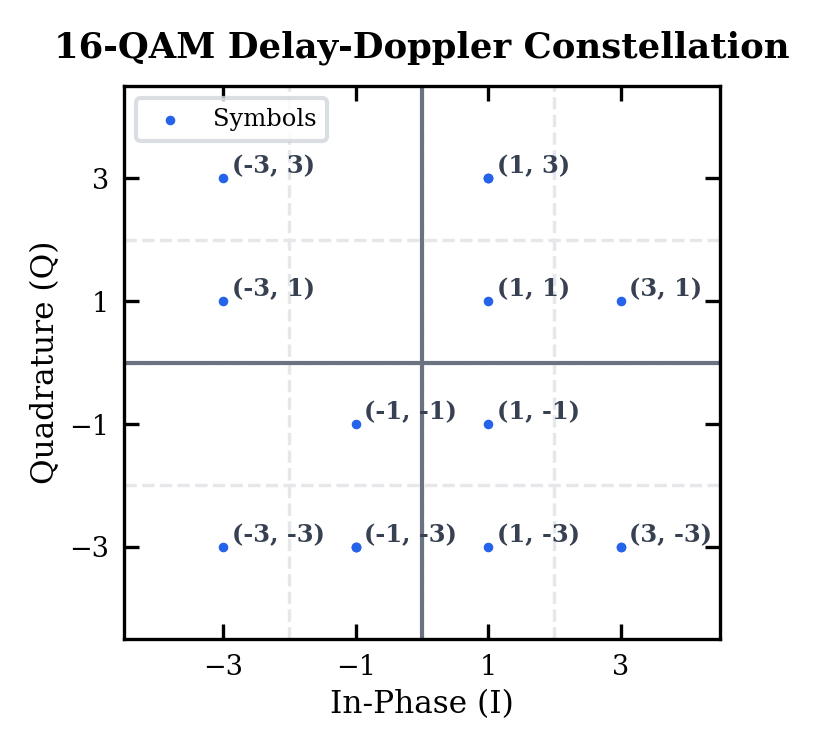
  <br/>
  <b>Figure 3: Visualization of the 16-QAM DD Constellation</b><br>
</div>

##### **Stage 3: ISFFT Domain Transformation (The Matrix Operator Sandwich)**

```python
# STAGE 3: ISFFT DOMAIN TRANSFORMATION (THE MATRIX OPERATOR SANDWICH)
# =====================================================================
# Generate scale-normalized forward and inverse unitary transformation matrices
W_M = (1.0 / np.sqrt(M)) * np.fft.fft(np.eye(M))
W_N_inv = (1.0 / np.sqrt(N)) * np.fft.ifft(np.eye(N)) * N  # Normalized scaling factor
# Execute 2D matrix transformation to yield Time-Frequency Grid X_TF
X_TF = np.dot(np.dot(W_M, D), W_N_inv)
```

- `W_M` is the normalized forward DFT matrix. Multiplying it from the left transforms each Delay axis column into the Frequency/Subcarrier direction.
- `W_N_inv` is the normalized inverse DFT matrix. Multiplying it from the right transforms each Doppler axis row into the Time Slot direction.
- The scale factors `1 / sqrt(M)` and `1 / sqrt(N)` keep the transform unitary, which preserves energy and avoids artificial gain during verification.
- `X_TF = np.dot(np.dot(W_M, D), W_N_inv)` is the ISFFT sandwich itself. It converts the Delay-Doppler frame `D` into the Time-Frequency grid `X_TF` that the Heisenberg transmit stage consumes next.

###  Week 2: Environmental Distortions & Receiver-Side Understanding

*Focus: Characterize environmental channel distortions and build receiver-side prototypes and simulations.*

---

#### Goals

- Survey propagation effects: multipath, delay spread, Doppler, fading (Rayleigh/Rician), and noise models.
- Map receiver architecture: RF front-end, ADC, synchronization (CFO/TO), channel estimation, equalization, demodulation, decoding.
- Implement simulation scripts for AWGN, multipath taps, Rayleigh/Rician fading, and Doppler shifts.
- Prototype receiver algorithms: synchronization, LS/MMSE channel estimation, ZF/MMSE equalizers, symbol detection and demapping.
- Run experiments (BER/SER vs SNR, SNR thresholds, effect of delay/Doppler) and collect results.
- Deliver a short report and presentation summarizing findings and recommended RTL migration steps.

#### Deliverables

- `scripts/python/` simulation examples and small receiver notebooks.
- CSV/JSON experiment results and plotted BER/SER curves.
- Short written report and a 5–10 slide presentation.
---
### **Day 6 (May 25, 2026): The Physics of the Channel – Multipath, Delay, and Doppler**

#### Objectives

- Understand the physical mechanisms that destroy transmitted signals in a terrestrial environment.
- Define **Inter-Symbol Interference (ISI)** caused by Delay Spread.
- Define **Inter-Carrier Interference (ICI)** caused by Doppler Shifts.
- Establish the mathematical reality of the **Doubly Dispersive Channel**.

---

##### 1. Multipath Propagation & The Illusion of LoS

In a perfect vacuum, communication is a straight line: a direct **Line of Sight (LoS)**.

In a real environment (cities, terrain, indoors), the antenna radiates energy in all directions.

When this energy hits:

- Buildings
- Cars
- Ground
- Walls
- Metallic objects

it reflects and scatters.

The receiver therefore captures:

- Direct LoS signal
- Multiple reflected echoes

This phenomenon is called:

###### Multipath Propagation

Each reflected copy arrives with:

- Different delay
- Different amplitude
- Different phase

---

##### 2. Delay Spread and Inter-Symbol Interference (ISI)

Reflected echoes travel longer distances than the direct signal.

Since radio waves travel at the speed of light:

:contentReference[oaicite:0]{index=0}

Where:

- $\tau_i$ = delay of path $\mathbf{i}$
- $d_i$ = distance traveled
-  c = speed of light

---

###### Delay Spread

The difference between:

- First arriving path
- Last arriving echo

is called:

###### Delay Spread

---

###### Inter-Symbol Interference (ISI)

If transmission is fast enough:

- Echo of Symbol 1 overlaps with Symbol 2
- Voltages combine physically
- Receiver cannot separate symbols cleanly

This creates:

###### ISI (Inter-Symbol Interference)

---

###### Role of Cyclic Prefix (CP)

The Cyclic Prefix acts as:

- A guard interval
- Artificial time buffer

It allows delayed echoes to die out before the next symbol is processed.

---

##### 3. Mobility, Doppler Shift, and Inter-Carrier Interference (ICI)

If:

- Transmitter moves
- Receiver moves
- Reflectors move

then channel geometry changes continuously.

This creates:

###### Doppler Shift

---

###### Doppler Effect

Moving toward wavefronts:

- Frequency increases

Moving away:

- Frequency decreases

The Doppler shift is denoted by:


$\nu$

---

###### Inter-Carrier Interference (ICI)

OFDM and OTFS rely on:

- Strict subcarrier orthogonality

If Doppler is severe:

- Frequency grid shifts
- Orthogonality breaks
- Subcarriers leak into neighbors

This causes:

###### ICI (Inter-Carrier Interference)

---

##### 4. The Doubly Dispersive Channel

When both:

- Delay spread exists
- Doppler spread exists

the channel becomes:

##### Doubly Dispersive

The received signal is modeled as:

:contentReference[oaicite:1]{index=1}

Where:

- $h_i$ = fading/amplitude scaling
- $\tau_i$ = delay spread component
- $\nu_i$ = Doppler shift
- $n(t)$ = thermal noise

This equation mathematically models:

- ISI
- ICI
- Fading
- Noise

simultaneously.

---

##### Key Intuition

| Effect | Physical Cause | Result |
|---|---|---|
| Delay Spread | Multipath echoes | ISI |
| Doppler Spread | Mobility | ICI |
| Fading | Reflection/destructive interference | Signal attenuation |

---

### **Day 7 (May 26, 2026): Theoretical Receiver Architecture – Undoing the Damage**

#### Objectives

- Understand the OTFS receiver pipeline
- Learn Frame Synchronization
- Understand Pilot Symbols
- Compare ZF and MMSE Equalizers

---

##### 1. Reverse Signal Pipeline

The transmitter converted:

- Delay-Doppler matrix
→ Time-frequency signal
→ Time-domain waveform

The receiver performs the reverse operation.

---

###### Receiver Stages

**Step 1 — ADC & CP Removal**

The antenna receives:

$y(t)$

The receiver:

- Digitizes the analog waveform
- Removes the Cyclic Prefix

This removes the most corrupted ISI region.

---

**Step 2 — Wigner Transform (FFT)**

Receiver performs:

- M-point FFT

This reconstructs the:

##### Time-Frequency Grid

$X_{TF}$

---

 **Step 3 — Symplectic FFT (SFFT)**

Receiver transforms data back into:

##### Delay-Doppler Domain

using:

**SFFT**

The output is:


$\hat{D}$

But it is still distorted by the channel.

---

##### 2. Frame Synchronization

Receiver continuously listens to noisy samples.

Question:

***How does it know where a frame begins?***


##### Preamble-Based Synchronization

Transmitter sends a known sequence:

#### Preamble

Receiver performs:

#### Cross-Correlation

It slides a stored copy across incoming samples.

When alignment occurs:

- Correlation spikes sharply
- Spike index becomes frame start

This defines:

$t = 0$

---

##### 3. Channel Estimation

Receiver cannot reverse distortion unless it knows the channel.

---

###### Pilot Symbols

Transmitter inserts known QAM symbols into fixed grid locations.

Example:

$5 + 5j$

at known coordinates.

---

###### Estimation Logic

Receiver compares:

| Expected Pilot | Received Pilot |
|---|---|
| \(5+5j\) | \(2.5+1j\) |

Difference reveals:

- Amplitude attenuation
- Phase rotation
- Delay/Doppler effects

Receiver then estimates:

##### Channel Matrix

$\hat{H}$

---

##### 4. Equalization

Goal:

Recover original transmitted symbols.

---

##### Zero Forcing (ZF)

ZF computes:

:contentReference[oaicite:3]{index=3}

and applies the inverse directly.

---

###### Problem with ZF

If a channel coefficient is near zero:


$\frac{1}{\text{tiny number}}$

becomes huge.

This amplifies thermal noise severely.

ZF works poorly in deep fades.

---

##### MMSE Equalizer

MMSE improves equalization by considering:

- Channel distortion
- Signal-to-noise ratio (SNR)

It balances:

- Undoing distortion
- Avoiding noise amplification

Result:

- More stable recovery
- Better practical performance

---

##### Final Detection

After equalization:

- Complex constellation points are cleaned
- Receiver maps them to nearest QAM coordinates
- Bits are recovered

Example:

$16\text{-QAM}$

maps each symbol back to 4 bits.

---

##### Core Big Picture

| Block | Purpose |
|---|---|
| CP Removal | Reduce ISI |
| FFT | Recover frequency-domain grid |
| SFFT | Recover delay-doppler symbols |
| Synchronization | Detect frame start |
| Pilot Estimation | Learn channel |
| Equalizer | Undo channel distortion |
| QAM Detection | Recover bits |

---

###### OTFS Receiver Philosophy

The receiver is essentially solving:

> “Given a distorted electromagnetic mess,
> what was originally transmitted?”

OTFS succeeds because the Delay-Doppler representation remains more stable under mobility and multipath than conventional OFDM.

### **Day 8 (May 27, 2026): Complex Baseband Signals & I/Q Decomposition**

#### **Objectives**

1. Understand why modern communication systems use complex-valued signal representations.
2. Relate QAM constellation symbols to In-Phase (I) and Quadrature (Q) components.
3. Understand the mathematical meaning of complex baseband signals.
4. Visualize how information is encoded using amplitude and phase.

---

##### 1. From QAM Symbols to Complex Samples

After the OTFS transmitter completes the ISFFT and Heisenberg transform operations, the output exists as a stream of complex-valued samples:

$$
x[n] = I[n] + jQ[n]
$$

where:

- \(I[n]\) represents the In-Phase component.
- \(Q[n]\) represents the Quadrature component.

Each complex sample corresponds to a unique point in the QAM constellation and contains both amplitude and phase information.

Unlike an RF waveform, these samples exist entirely inside the digital processing chain and are therefore referred to as **complex baseband samples**.

---

##### 2. Orthogonal Basis Functions

Modern communication systems use two orthogonal carrier components:

$$
\cos(2\pi f_c t)
$$

and

$$
\sin(2\pi f_c t)
$$

These functions are orthogonal over a symbol interval:

$$
\int_0^T
\cos(2\pi f_c t)
\sin(2\pi f_c t)\,dt = 0
$$

Because of this orthogonality, two independent information streams can occupy the same frequency band without interfering with each other.

---

##### 3. Geometric Interpretation of a Complex Symbol

A QAM symbol may be represented as:

$$
s = I + jQ
$$

where:

- \(I\) determines the horizontal coordinate.
- \(Q\) determines the vertical coordinate.

The symbol magnitude is:

$$
|s| = \sqrt{I^2 + Q^2}
$$

and the phase is:

$$
\theta = \tan^{-1}\left(\frac{Q}{I}\right)
$$

Thus, every constellation point uniquely specifies a signal amplitude and phase.

---

##### Key Understanding

A QAM symbol is not a physical waveform.

It is a complex coordinate that stores amplitude and phase information digitally before RF modulation is performed.

---

### **Day 9 (May 28, 2026): RF Upconversion Using I/Q Modulation**

#### **Objectives**

1. Understand the transition from complex baseband signals to RF signals.
2. Study the mathematical model of quadrature modulation.
3. Generate a physically transmittable RF waveform from I/Q samples.
4. Visualize the role of carrier frequency translation.

---

##### 1. Why Upconversion Is Necessary

The OTFS transmitter generates information-bearing signals around DC (0 Hz).

These low-frequency signals cannot be efficiently radiated by practical antennas.

Therefore, the signal must be translated to a higher carrier frequency \(f_c\) before transmission.

---

##### 2. I/Q Modulator Architecture

The RF waveform is generated using the In-Phase and Quadrature components:

$$
s_{RF}(t)
=
I(t)\cos(2\pi f_c t)
-
Q(t)\sin(2\pi f_c t)
$$

where:

- \(I(t)\) modulates the cosine carrier.
- \(Q(t)\) modulates the sine carrier.

The resulting waveform is real-valued and can be transmitted through an antenna.

---

##### 3. Simulation Activities

The following steps were performed:

- Extracted the real component as the I stream.
- Extracted the imaginary component as the Q stream.
- Generated sinusoidal carrier waveforms.
- Mixed the I branch with the cosine carrier.
- Mixed the Q branch with the sine carrier.
- Combined both branches to generate the final RF signal.

---
##### Simulation Results

The following simulation was performed to reconstruct a continuous-time complex baseband waveform from the discrete Heisenberg transform output and subsequently generate a real RF waveform suitable for transmission.

```python
import numpy as np

# =====================================================================
# COMPLEX BASEBAND INTERPOLATION AND RF UPCONVERSION
# =====================================================================

# Serialize the 2-D Heisenberg output into a single streaming frame
final_tx_signal = time_domain_slots.flatten(order='F')

# Preserve complex-valued I/Q samples
tx_complex_samples = np.asarray(final_tx_signal, dtype=complex)

# Continuous interpolation axis
t_analog = np.linspace(0, len(tx_complex_samples) - 1, 1000)

# Convert sample indices into physical time
Ts = 1.0 / (M * Delta_f)
t_seconds = t_analog * Ts

# Sinc interpolation of I and Q components
i_analog_wave = np.zeros_like(t_analog, dtype=float)
q_analog_wave = np.zeros_like(t_analog, dtype=float)

for n, symbol in enumerate(tx_complex_samples):

    sinc_basis = np.sinc(t_analog - n)

    i_analog_wave += symbol.real * sinc_basis
    q_analog_wave += symbol.imag * sinc_basis

# Reconstructed complex baseband signal
complex_baseband_wave = (
    i_analog_wave +
    1j * q_analog_wave
)

# RF upconversion
fc = 10000.0

rf_tx_signal = np.real(
    complex_baseband_wave *
    np.exp(1j * 2 * np.pi * fc * t_seconds)
)
```

**Observations**

- The discrete complex samples produced by the Heisenberg transform were successfully reconstructed into continuous-time I(t) and Q(t) waveforms using sinc interpolation.
- The reconstructed baseband signal preserved both amplitude and phase information contained within the original OTFS symbols.
- Quadrature modulation shifted the signal from baseband to the desired carrier frequency of 10 kHz.
- The resulting waveform became a purely real-valued RF signal suitable for DAC generation and antenna transmission.
- The simulation verified the complete signal flow from complex baseband representation to physical RF waveform synthesis.

---

<div align="center">
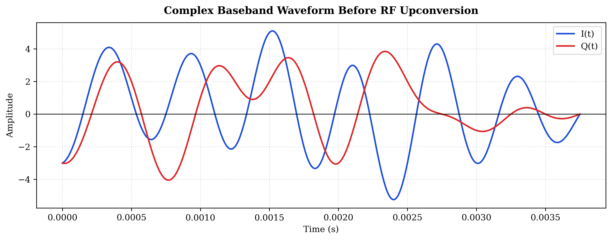

**Figure 8.1:** Complex baseband waveform showing the reconstructed In-Phase \(I(t)\) and Quadrature \(Q(t)\) components after sinc interpolation.
</div>

<div align="center">
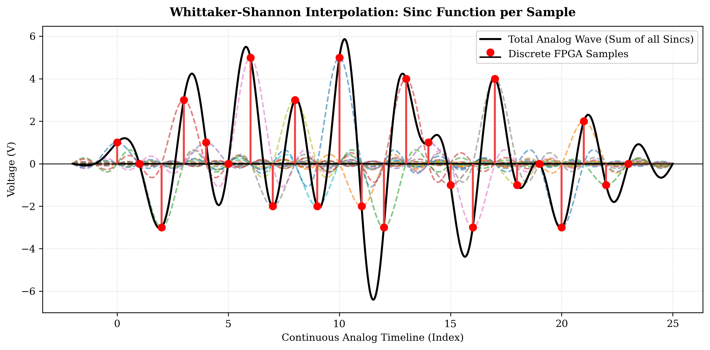

**Figure 9.1:** Real RF waveform generated through quadrature modulation of the complex baseband signal.
</div>

##### 4. Physical Interpretation

The I and Q branches independently control the amplitude and phase of the transmitted carrier.

Together they allow a single RF signal to carry complex information without requiring multiple frequency channels.

---

##### Key Understanding

Although OTFS processing relies heavily on complex arithmetic, the antenna ultimately transmits a single real-valued RF waveform generated through quadrature modulation.

---

### **Day 10 (May 29, 2026): Sinc Interpolation & Continuous-Time Waveform Reconstruction**

#### **Objectives**

1. Understand the difference between discrete-time samples and continuous-time signals.
2. Study pulse-shaping and interpolation techniques.
3. Investigate the orthogonality properties of sinc functions.
4. Reconstruct a continuous-time approximation of the transmitted waveform.

---

##### 1. Discrete Samples Versus Physical Signals

The Heisenberg transform produces a sequence of discrete-time samples:

$$
x[0], x[1], x[2], \dots, x[N-1]
$$

However, a real communication channel requires a continuously varying voltage waveform.

Therefore, the discrete samples must be reconstructed into a continuous signal before transmission.

---

##### 2. Ideal Sinc Interpolation

The ideal interpolation kernel is the sinc function:

$$
\operatorname{sinc}(x)
=
\frac{\sin(\pi x)}{\pi x}
$$

Each transmitted sample generates a shifted sinc pulse.

The continuous waveform is obtained by summing all shifted sinc functions:

$$
x(t)
=
\sum_{n=-\infty}^{\infty}
x[n]
\operatorname{sinc}
\left(
\frac{t-nT_s}{T_s}
\right)
$$

where \(T_s\) is the sampling interval.

---

##### 3. Orthogonality Property

A key property of the sinc function is:

$$
\operatorname{sinc}(n)=0
\qquad
n \neq 0
$$

This means that every pulse reaches zero exactly at the sampling locations of neighboring symbols.

Consequently, symbols can overlap in time without creating Inter-Symbol Interference (ISI).

---

##### 4. Simulation Activities

The following investigations were performed:

- Applied sinc interpolation to generated OTFS baseband samples.
- Visualized discrete sample locations.
- Reconstructed a continuous-time waveform.
- Examined pulse overlap behavior.
- Verified zero-crossing properties of neighboring sinc pulses.

---
##### Simulation Results

The sinc interpolation process was visualized to verify reconstruction of the continuous-time waveform from discrete OTFS samples.

<div align="center">
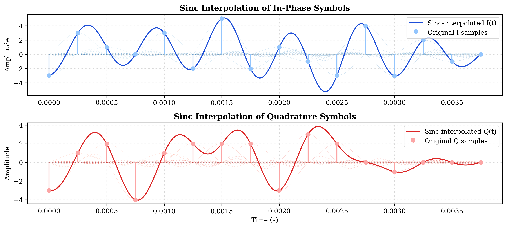

**Figure 10.1:** Sinc interpolation applied independently to the In-Phase and Quadrature sample streams. The markers indicate original discrete samples while the continuous curves represent the reconstructed waveform.
</div>

**Observations**

- Every transmitted sample generated a shifted sinc basis function.
- The superposition of all sinc functions reconstructed a smooth continuous-time waveform.
- Neighboring sinc pulses crossed zero at sampling locations, preserving symbol orthogonality.
- The reconstructed waveform matched the original sample values exactly at sampling instants.
- The simulation demonstrated the theoretical foundation of pulse shaping and waveform reconstruction used in digital communication systems.

---

##### 5. Relationship to the Heisenberg Transform

The Heisenberg transform produces discrete-time waveform samples.

Sinc interpolation provides a mathematical approximation of how those samples evolve into a smooth continuous-time signal suitable for RF transmission.

### **Day 11 (May 30, 2026): Cyclic Prefix Insertion & Multipath Channel Preparation**

#### **Objectives**

1. Understand why wireless communication systems require a Cyclic Prefix (CP).
2. Study how delayed echoes create Inter-Symbol Interference (ISI).
3. Learn how CP transforms a linear convolution channel into a circular convolution channel.
4. Implement Cyclic Prefix insertion in the OTFS transmit chain.
5. Prepare the transmitter waveform for upcoming multipath channel simulations.

---

##### 1. Why Multipath Creates a Problem

In a practical wireless environment, transmitted signals do not arrive at the receiver through a single path.

Instead, reflections from buildings, vehicles, terrain, and surrounding objects generate multiple delayed copies of the transmitted waveform.

The received signal can therefore be expressed as:

$$
r(t)
=
\sum_{i=0}^{L-1}
h_i s(t-\tau_i)
$$

where:

- $h_i$ represents the gain of the $i^{th}$ path.
- $\tau_i$ represents the propagation delay.
- $L$ denotes the total number of propagation paths.

When these delayed copies extend beyond the symbol boundary, they overlap with subsequent symbols and create Inter-Symbol Interference (ISI).

---

##### 2. The Concept of the Cyclic Prefix

To protect transmitted symbols from delayed echoes, communication systems insert a guard interval before each transmitted block.

Instead of appending zeros, the final samples of the symbol are copied and placed at the beginning.

For a transmitted symbol:

$$
x[n]
=
[x_0,x_1,\dots,x_{N-1}]
$$

the Cyclic Prefix operation generates:

$$
x_{CP}[n]
=
[x_{N-N_{CP}},\dots,x_{N-1},
x_0,x_1,\dots,x_{N-1}]
$$

where \(N_{CP}\) denotes the cyclic prefix length.

This additional interval absorbs delayed multipath components before they reach the useful symbol region.

---

##### 3. Why the Prefix Must Be Cyclic

The prefix is not arbitrary.

Copying the tail of the symbol preserves periodicity across the symbol boundary.

As a result, the receiver observes a circular convolution rather than a linear convolution.

This property is extremely important because FFT-based communication systems rely on circular convolution for efficient equalization and channel compensation.

Without a Cyclic Prefix:

$$
y[n]
=
h[n] * x[n]
$$

where \(*\) denotes linear convolution.

With a sufficiently long Cyclic Prefix:

$$
y[n]
=
h[n]
\circledast
x[n]
$$

where \(\circledast\) denotes circular convolution.

This allows the channel effects to be handled efficiently in the frequency domain.

---

##### 4. Cyclic Prefix in the OTFS Transmission Chain

The OTFS transmitter currently generates a sequence of time-domain symbols through the Heisenberg transform.

Before transmission, a Cyclic Prefix is added to each symbol independently.

The resulting processing chain becomes:

```text
Delay-Doppler Symbols
        ↓
      ISFFT
        ↓
 Time-Frequency Grid
        ↓
 Heisenberg Transform
        ↓
 Time-Domain Symbols
        ↓
 Cyclic Prefix Insertion
        ↓
   Channel Model
```

---

##### Simulation Results

The following simulation was performed to append a Cyclic Prefix to each transmitted OTFS symbol.

```python
import numpy as np

# ==========================================================
# CYCLIC PREFIX INSERTION
# ==========================================================

N_CP = 2

slots_with_cp = []

for slot in time_domain_slots.T:

    cp = slot[-N_CP:]

    slot_with_cp = np.concatenate([
        cp,
        slot
    ])

    slots_with_cp.append(slot_with_cp)

tx_with_cp = np.concatenate(slots_with_cp)
```

**Observations**

- The final \(N_{CP}\) samples of each symbol were successfully copied to the front of the symbol.
- The useful information content remained unchanged.
- The overall symbol duration increased from \(N\) samples to \(N + N_{CP}\) samples.
- The generated waveform is now prepared for multipath channel simulations.
- The inserted guard interval will absorb delayed echoes generated by the channel.

---

<div align="center">
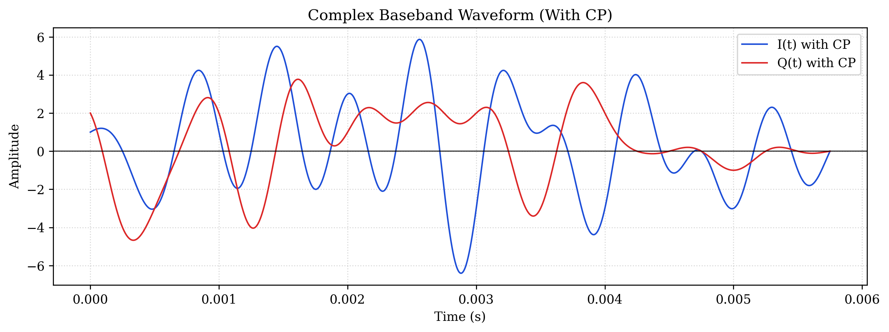

**Figure 11.1:** Cyclic Prefix insertion process showing the final samples of a symbol copied to the beginning of the transmission block.
</div>

<div align="center">
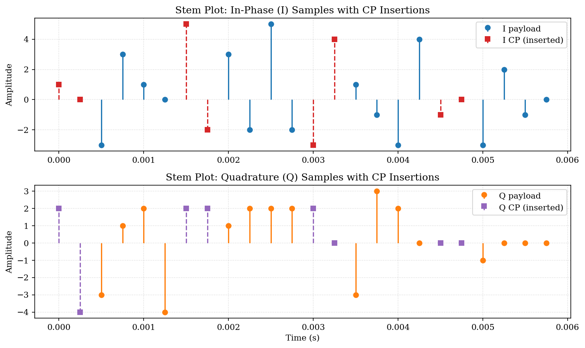

**Figure 11.2:** Discrete In-Phase and Quadrature sample streams illustrating Cyclic Prefix insertion. The colored payload samples correspond to the original OTFS symbol data, while the highlighted prefix samples represent copies of the final symbol samples inserted at the beginning of each transmission block.
</div>

<div align="center">
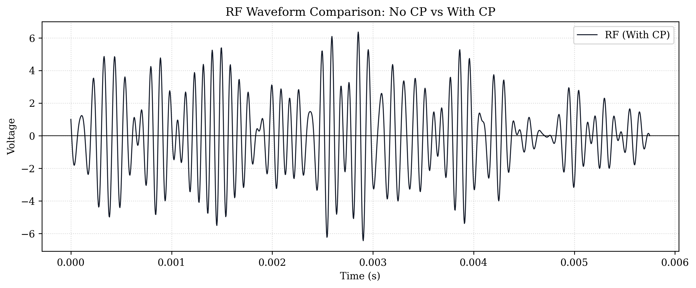

**Figure 11.3:** RF waveform after Cyclic Prefix insertion. The transmitted waveform now contains guard intervals that extend the duration of each transmitted OTFS symbol while maintaining the original information-bearing waveform structure.
</div>

---

##### Key Understanding

The Cyclic Prefix does not increase data throughput or improve signal quality directly. Its primary purpose is to protect the useful symbol interval from delayed multipath echoes and enable efficient FFT-based processing at the receiver. This mechanism forms the foundation for studying multipath propagation, delay spread, and Inter-Symbol Interference in subsequent channel simulations.

### **Day 12 (May 31, 2026): Delay–Doppler Channel Modeling & Individual Path Generation**

#### Objectives

1. Implement a realistic wireless propagation channel.
2. Simulate multipath delay spread.
3. Introduce Doppler shifts caused by mobility.
4. Generate individual channel paths for later RF combination.
5. Visualize the impact of delay and Doppler on complex baseband signals.

---

##### 1. Motivation

Until this stage, the transmitter produced an ideal RF waveform.

Real wireless channels introduce distortions due to:

- Reflections
- Scattering
- Mobility
- Relative motion

As a result, the receiver observes multiple delayed and frequency-shifted copies of the transmitted signal.

---

##### 2. Multipath Channel Model

The received signal consists of multiple propagation paths.

Each path is characterized by:

- Delay
- Doppler shift
- Path gain

For path \(i\):

$$
r_i(t)
=
s(t-\tau_i)
e^{j2\pi f_{D,i} t}
$$

where

- \(s(t)\) = transmitted signal
- \(\tau_i\) = propagation delay
- \(f_{D,i}\) = Doppler shift

---

##### 3. Channel Parameters

The following channel profile was implemented.

| Path | Delay (μs) | Doppler Shift (Hz) |
|--------|--------|--------|
| Path 1 | 0 | 0 |
| Path 2 | 250 | +350 |
| Path 3 | 625 | -200 |

These values emulate a receiver observing:

- Direct line-of-sight energy
- One positive-Doppler reflection
- One negative-Doppler reflection

---

##### 4. Delay Implementation

Each path was delayed independently.

The delay operation was implemented by shifting the waveform in time according to:

$$
\tau_i
=
\frac{d_i}{c}
$$

where:

- \(d_i\) is path length
- \(c\) is speed of light

The delayed copies begin later in the observation window and represent reflected signal arrivals.

---

##### 5. Doppler Implementation

After delaying the signal, Doppler shifts were applied through complex phase rotation.

$$
e^{j2\pi f_{D,i}t}
$$

Positive Doppler corresponds to approaching motion.

Negative Doppler corresponds to receding motion.


---
##### 6. Channel Model Implementation

To simulate a realistic wireless propagation environment, two reusable functions were developed.

The first function generates delayed replicas of the transmitted waveform on a common time axis. The second function applies Doppler-induced frequency shifts to each delayed path.

---

###### Fractional Delay Generation

The following function creates delayed versions of the transmitted complex waveform.

```python
def add_fractional_delays(signal, t_seconds, delays_us):
    """Generate delayed replicas of a complex waveform on a common extended time grid.

    Parameters
    ----------
    signal : np.ndarray
        Complex-valued waveform samples.
    t_seconds : np.ndarray
        Original time axis for the waveform.
    delays_us : list[float]
        Path delays in microseconds.

    Returns
    -------
    delayed_paths : list[np.ndarray]
        One delayed waveform per propagation path.
    t_extended : np.ndarray
        Common time axis extended to fit the longest delay.
    """

    signal = np.asarray(signal)
    t_seconds = np.asarray(t_seconds, dtype=float)
    delays_us = list(delays_us)

    if signal.ndim != 1:
        raise ValueError("signal must be a 1D waveform")

    if t_seconds.ndim != 1:
        raise ValueError("t_seconds must be a 1D time axis")

    if len(signal) != len(t_seconds):
        raise ValueError(
            "signal and t_seconds must have the same length"
        )

    if len(t_seconds) < 2:
        raise ValueError(
            "t_seconds must contain at least two samples"
        )

    tau_seconds = [
        delay_us * 1e-6
        for delay_us in delays_us
    ]

    max_delay = max(tau_seconds, default=0.0)

    dt = t_seconds[1] - t_seconds[0]

    t_extended = np.arange(
        0.0,
        t_seconds[-1] + max_delay + 0.5 * dt,
        dt
    )

    interp_real = lambda query_times: np.interp(
        query_times,
        t_seconds,
        np.real(signal),
        left=0.0,
        right=0.0
    )

    interp_imag = lambda query_times: np.interp(
        query_times,
        t_seconds,
        np.imag(signal),
        left=0.0,
        right=0.0
    )

    delayed_paths = []

    for tau in tau_seconds:

        shifted_times = t_extended - tau

        delayed_wave = (
            interp_real(shifted_times)
            +
            1j * interp_imag(shifted_times)
        )

        delayed_paths.append(delayed_wave)

    return delayed_paths, t_extended
```

---

###### Doppler Shift Application

After generating delayed replicas, Doppler shifts were applied independently to each path.

```python
def apply_doppler(
    delayed_paths,
    t_extended,
    dopplers_hz
):
    """Apply Doppler shifts to delayed complex paths."""

    delayed_paths = [
        np.asarray(path)
        for path in delayed_paths
    ]

    t_extended = np.asarray(
        t_extended,
        dtype=float
    )

    dopplers_hz = list(dopplers_hz)

    if len(delayed_paths) != len(dopplers_hz):
        raise ValueError(
            "delayed_paths and dopplers_hz "
            "must have the same length"
        )

    if t_extended.ndim != 1:
        raise ValueError(
            "t_extended must be a 1D time axis"
        )

    doppler_paths = []

    for path, fd in zip(
        delayed_paths,
        dopplers_hz
    ):

        doppler_path = (
            path *
            np.exp(
                1j *
                2 *
                np.pi *
                fd *
                t_extended
            )
        )

        doppler_paths.append(
            doppler_path
        )

    return doppler_paths
```

---

###### Channel Parameter Configuration

The simulation used the following propagation parameters.

```python
path_delays_us = [
    0,
    250,
    625
]

path_dopplers_hz = [
    0,
    350,
    -200
]
```

---

###### Channel Path Generation

```python
delayed_paths, t_extended = add_fractional_delays(
    complex_baseband_wave,
    t_seconds,
    path_delays_us
)

doppler_paths = apply_doppler(
    delayed_paths,
    t_extended,
    path_dopplers_hz
)
```

These generated paths represent the individual delay-Doppler components of the wireless channel and form the basis for the RF multipath synthesis performed in the following day.
---
##### Simulation Results

The generated channel paths are shown below.

<div align="center">

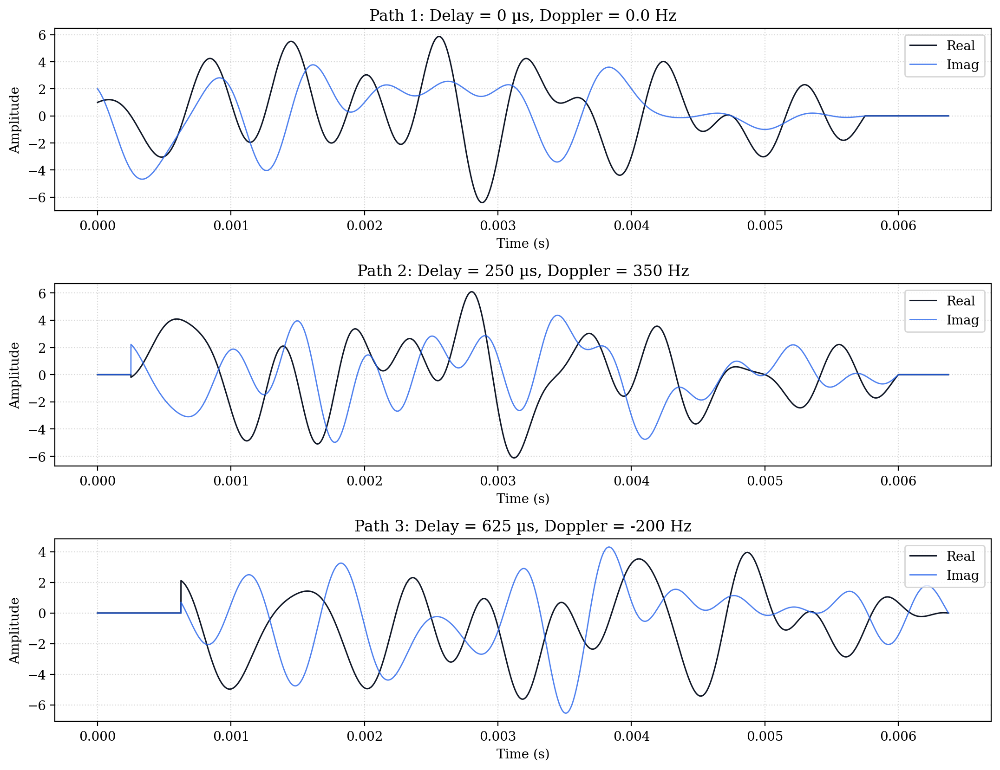

**Figure 12.1:** Complex baseband representations of the three channel paths. Delays create shifted arrivals while Doppler shifts alter phase evolution.

</div>

---

##### Observations

- Path 1 arrives immediately.
- Path 2 begins after 250 μs.
- Path 3 begins after 625 μs.
- Positive Doppler causes accelerated phase rotation.
- Negative Doppler produces reverse phase evolution.
- The channel now contains both delay spread and Doppler spread.

---

##### Key Understanding

A wireless channel does not simply attenuate signals.

Instead, it generates multiple delayed and Doppler-shifted replicas that occupy different regions of the delay-Doppler plane.

This forms the foundation of OTFS channel modeling.

### **Day 13–14 (June 1–2, 2026): RF Multipath Synthesis, Receiver Downconversion & Complex Baseband Recovery**

#### **Objectives**

1. Combine all delayed and Doppler-shifted propagation paths into a single received RF waveform.
2. Visualize the RF-domain representation of individual propagation paths.
3. Study constructive and destructive interference caused by multipath propagation.
4. Implement receiver-side quadrature downconversion.
5. Recover the complex baseband signal from the received RF waveform.
6. Apply low-pass filtering to remove mixer image frequencies.
7. Downsample the recovered waveform for symbol-rate processing.
8. Prepare the signal for constellation regeneration and symbol recovery.

---

##### 1. RF Path Generation

The delayed and Doppler-shifted channel paths generated in the previous stage were converted into RF-domain waveforms.

Each path contains:

- Propagation delay
- Doppler shift
- Phase distortion
- Amplitude scaling

The RF representation of path \(i\) can be expressed as

$$
r_i(t)
=
g_i
s(t-\tau_i)
e^{j2\pi f_{D,i}t}
$$

where:

- \(g_i\) is the path gain
- \(\tau_i\) is the propagation delay
- \(f_{D,i}\) is the Doppler shift

---

##### RF Path Visualization

Before combining the individual propagation paths, each RF path was visualized independently.

The simulated channel parameters were:

| Path | Delay (μs) | Doppler Shift (Hz) |
|--------|--------|--------|
| Path 1 | 0 | 0 |
| Path 2 | 250 | +350 |
| Path 3 | 625 | -200 |

---

##### Simulation Results

<div align="center">

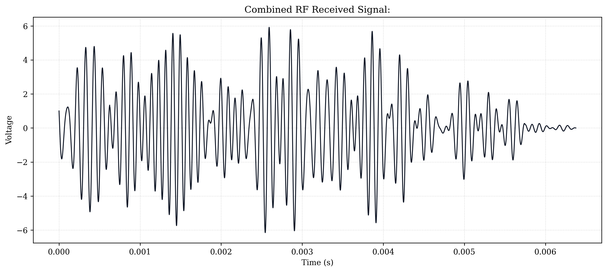

**Figure 13.1:** RF-domain representation of the three propagation paths after delay and Doppler application.

</div>

---

##### Observations

- Path 1 represents the direct line-of-sight component.
- Path 2 arrives 250 μs later and experiences a positive Doppler shift.
- Path 3 arrives 625 μs later and experiences a negative Doppler shift.
- Each path exhibits unique phase evolution due to Doppler modulation.
- These paths collectively form the wireless channel seen by the receiver.

---

##### 2. Multipath Signal Superposition

The receiver does not observe the individual paths separately.

Instead, all propagation paths arrive simultaneously and add together according to the principle of superposition.

The received signal is therefore

$$
r(t)
=
\sum_{i=1}^{P}
g_i
s(t-\tau_i)
e^{j2\pi f_{D,i}t}
$$

where:

- \(P\) is the number of propagation paths
- \(g_i\) is the path gain
- \(\tau_i\) is the delay
- \(f_{D,i}\) is the Doppler frequency

---

##### Path Gain Assignment

To emulate realistic attenuation, gain coefficients were assigned to each path.

```python
rf_path_gains = np.linspace(
    1.0,
    0.5,
    len(rf_doppler_paths)
)
```

The direct path was assigned the highest gain while reflected paths experienced increasing attenuation.

---

##### Multipath Combination Function

```python
def combine_multipath_paths(paths, gains):

    rx_signal = np.zeros_like(
        paths[0],
        dtype=complex
    )

    for path, gain in zip(paths, gains):
        rx_signal += gain * path

    return rx_signal
```

---

##### Simulation Execution

```python
rf_rx_signal = combine_multipath_paths(
    rf_doppler_paths,
    rf_path_gains
)

rf_rx_signal = rf_rx_signal.real
```

---

##### Simulation Results

<div align="center">

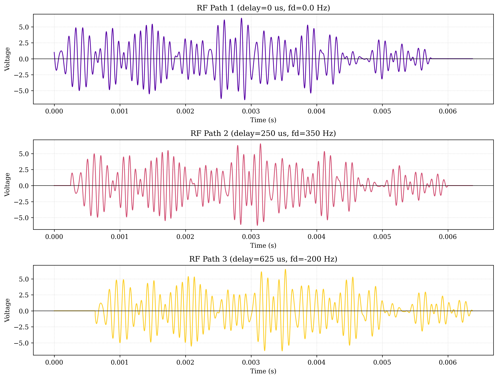

**Figure 13.2:** Combined RF received signal obtained after summing all delayed and Doppler-shifted propagation paths.

</div>

---

##### Observations

- Constructive interference generated large amplitude peaks.
- Destructive interference generated deep fading regions.
- Time-varying fading became clearly visible.
- The received waveform differs significantly from the transmitted RF waveform.
- Delay spread and Doppler spread jointly distort the signal.

---

##### 3. Receiver Quadrature Downconversion

The received RF waveform occupies a band centered around the carrier frequency \(f_c\).

To recover the transmitted information, the receiver performs quadrature downconversion.

The received signal is multiplied by a locally generated carrier:

$$
r_{BB}(t)
=
r_{RF}(t)
e^{-j2\pi f_c t}
$$

This shifts the desired spectrum from the carrier frequency back to DC.

---

##### Downconversion Implementation

```python
rx_complex_mixed = (
    rf_rx_signal *
    np.exp(
        -1j *
        2 *
        np.pi *
        fc *
        t_extended
    )
)
```

---

##### 4. Low-Pass Filtering

The mixing operation generates two spectral components:

$$
f_c-f_c = 0
$$

and

$$
f_c+f_c = 2f_c
$$

The component near \(2f_c\) contains no useful information and must be removed.

A low-pass filter was therefore applied to isolate the baseband spectrum.

---

##### Low-Pass Filter Implementation

```python
from scipy.signal import butter, filtfilt

cutoff_hz = 2000

b, a = butter(
    5,
    cutoff_hz /
    (0.5 * sample_rate)
)

rx_baseband_filtered = filtfilt(
    b,
    a,
    rx_complex_mixed
)
```

---

##### 5. Downsampling

The transmitted waveform was previously oversampled to approximate a continuous-time signal.

After filtering, the signal was returned to the original symbol-rate processing frequency.

```python
rx_downsampled = rx_baseband_filtered[
    ::oversampling_factor
]
```

This reduces computational complexity while preserving the transmitted information.

---

##### Simulation Results

<div align="center">

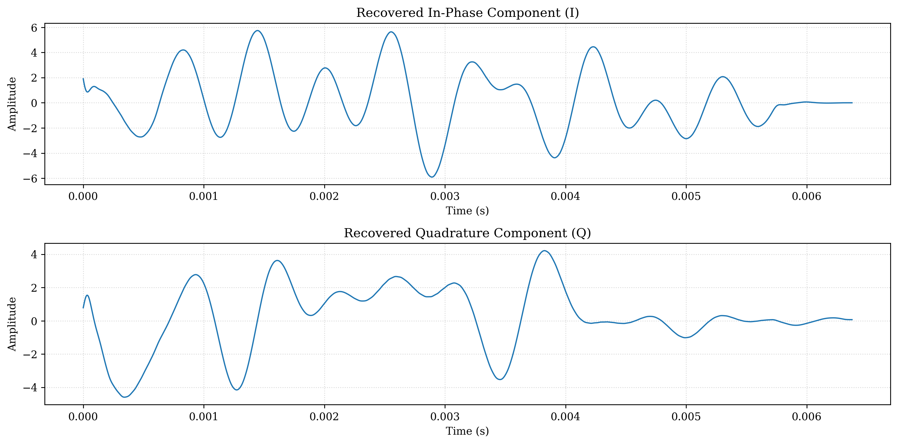

**Figure 13.3:** Recovered complex baseband waveform after downconversion, low-pass filtering, and downsampling.

</div>

---

##### Observations

- The RF carrier was successfully removed.
- The complex envelope was recovered.
- I/Q information remained intact.
- Delay and Doppler distortions remained visible.
- The signal was successfully prepared for constellation regeneration.

---

##### Key Understanding

The receiver successfully reversed the RF upconversion process and recovered a complex baseband representation of the transmitted signal. Although the channel impairments remained present, the information-bearing waveform was preserved and prepared for symbol extraction and constellation reconstruction in the next stage.